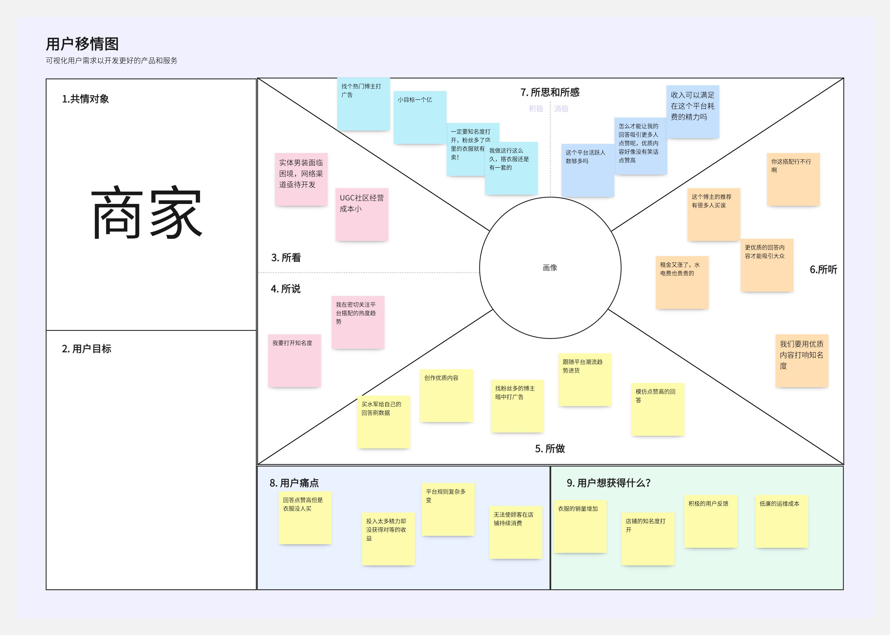

# 商业模式设计

## 一、基本信息

### 1.组员信息

| 姓名       | 学号      |
| ---------- | --------- |
| 周岩松(PM) | 201250060 |
| 靳琦清     | 201250063 |
| 王昕妍     | 201250061 |
| 闻博       | 201250065 |

### 2.度量数值

- 客户洞察部分的移情图：**个**；

- 构思部分的候选创意：**个**；

- 模型构建更新的画布内总要点数量：**个**；关联关系：**个**；引用的调研报告和新闻报道：**篇**；

- 讲故事部分的故事数量：**个**；

- 场景要点数量：**个**；

---

## 二、文档简介

​	本小组按照前阶段的商业模式画布和评估结果，使用教材讲述的六种设计方法，完善了之前的设计和评估结果。对前阶段的商业模式画布进行了修改和整合。通过客户洞察，我们全面地分析了客户的整体需求，并讲故事和可视化等方式，修改了原先画布和设计中不合理并大而空的元素，使得设计结果更加合理，具体。六种设计方法的产物作为本文档的六个章节逐一描述。

## 三、商业模式设计

### 1.客户洞察 

------

#### 1.1 各类博主

​		Mirrors为各类博主提供了一个有良好用户活性，有较大讨论社区平台和合理创作收入的定制化穿搭交流社区。在本平台中，博主用户能够通过分享专业而合理的穿搭知识以积累其他用户的赞同和认可，同时，平台也会根据博主创作的内容给予一定的创作激励。平台提供的付费问询功能能够为博主获取一定的创作收入。在Mirrors中，博主无需担忧平台用户的流失和积累粉丝资源的消失，同时也能收获到合理的创作收入，定制化的问答算法也能使得博主在创作时获取一定的针对性。

#### 1.2 免费用户

​		作为一个穿搭类知识分享社区，免费用户所带来的社区活跃度和流量是不可忽视的，因此必然要服务于免费用户。免费用户一般来说都是平台的普通使用者，他们会在意平台服务带给他们的使用体验，是否实现了使用该平台的目的，以及在平台社区中自身的位置和价值。Mirrors通过丰富的社区内容、基于个性化身体参数匹配的定制化问答算法、基于大数据推荐的社区机制、社区激励和等级机制、完整的人工和智能客服服务等，来提高免费用户的使用满意度和留存率，同时也能提高他们成为付费用户的转化率。

#### 1.3 商家

​		UGC社区的模式建立在社区的互助交流分享平台的前提上，去中心化的社区氛围很难形成个人化的IP，使得内容创作者建立稳固庞大的粉丝矩阵，这种情况一方面会对作为创作者的不利，因为读者不会对账号产生依赖进而关注店铺。但对内容优劣的重视也会使得商家的运维投入成本可以相对减少。同时社区互助交流的形式天然屏蔽了电商行业痛点，商家无需担心复杂多变的平台规则会导致的多余的运维投入。而从事男装行业，熟悉基本搭配的优势可以很快使商家进入创作者的角色。去中心化的社区氛围很难形成个人化的IP，使得内容创作者建立稳固庞大的粉丝矩阵，这种情况一方面会对作为创作者的不利，因为读者不会对账号产生依赖进而关注店铺

#### 1.4 男性群体

​		男性群体一直是穿搭领域的蓝海。我们平台的战略重点之一就是吸引更多男性用户，让他们认识到提升穿搭水平的重要性和可行性，并提供对他们有持久吸引力的社区氛围，使这一群体成为平台的基本流量。男性相对来说不愿意在穿搭方面花费太多时间，尤其容易排斥逛街等活动。但是许多男性又有通过穿搭来提升自身气质、吸引力的需求，他们只是缺少一个在时间、专业性、成本、舒适度的权衡上能提供高性价比的平台，Mirrors恰恰关注了这一痛点，通过线上的方式节约了时间与精力成本，通过专业咨询服务提升了用户获得感、增进正反馈，通过购买比价降低支出，利用网络平台的匿名性提高用户的参与意愿，让用户敢于发问、愿意表达。

### 2.构思 

------

1.从客户驱动的角度出发

​		如果部分用户想要提高定制化匹配算法的精度怎么办？

​		平台为用户提供的定制化匹配算法包括根据用户的身高，体重，腰围，胸围等数据获取用户独特的生理参数。再通过定制化匹配算法，将用户的问答和圈子等信息匹配给与该用户生理参数相似的其他用户，从而使得问答和圈子推荐更具有针对性和定制性。我们设想当部分用户想要提高定制化匹配算法的精度时，将需要Mirrors对该机制进行优化。我们将推出VIP增值服务和客制化服务，当充值VIP后，用户将解锁更多的生理参数输入位，通过补齐这些更加精确和丰富的生理参数，用户的匹配算法机制将进一步完善，获得更加优秀和效果更好的定制化穿搭匹配体验。

​		通过在VIP服务中完善Mirrors的生理参数系统，一方面用户能够得到更加好的匹配式问答体验，另一方面平台的增值服务也将获得用户的认可，将会有更多的用户选择购买，从而助长平台的收入提升。

2.从客户驱动的角度出发

​		如果（大部分）潜水用户只浏览，从不进行提问、回答和创作怎么办？

​		为了提高社区活跃度，必须要努力将潜水用户转化为发言的活跃用户，为此平台需要从多个方面进行努力。从激励方面讲，平台鼓励用户发言（包括提问、回答、创作等）， 为这些用户提供社区等级、荣誉、物质或其他形式的奖励。从社区氛围方面讲，平台将努力营造一个活跃的社区氛围，当看到其他用户（或用户自己）通过提问、回答、创作获得一次良好的使用体验时（如找到了合适的穿搭、收获了大量认同、取得了创作激励等），将会鼓励用户去尝试或继续进行发言，从而进一步提高社区活跃度，实现良性循环。其他可能专门采取的措施还有讲述普通用户的创作之路故事、重点鼓励第一次发言经历的用户等。

3.从财务驱动的角度出发

​		如果我们的咨询收费模式从一次性付费转变为其他收费模式会怎么样？

​		收费模式对于用户依赖性的形成有着重要影响。如果付费咨询转变为订阅制，可以提供阶梯定价模式。对于需求量比较大或者要求较高的用户，提供价格昂贵、不限交流次数的私人定制服务，满足头部用户的高端穿搭造型需求；对于每天都对当日穿搭有一定要求的用户，可以提供每日限次数咨询服务，定价中等；对于偶尔有咨询需求的用户，可以向他们宣传成为平台的长期会员（结合平台的VIP业务或者是用户的等级），使其在付费咨询时享受一定的折扣，并在每个月份/季度赠予一些免费咨询次数，用长期高质量的体验式服务逐渐将免费用户转化为轻度付费用户（用完免费次数后偶有考虑付费咨询）甚至是核心付费用户。非订阅制下也可以打包出售咨询服务，以高性价比的折扣价出售多次的咨询服务（比如3次9折，30次8折），不限截止日期，同样可以划分阶梯式定价满足不同的需求。

4.从产品/服务驱动的角度出发

​		如果用户厌倦了信息量过载的穿搭话题，社区缺乏年轻活性会怎么样。

​		由于我们主要针对的客户群体是年轻一代男性，他们对穿搭的需求尚未被市场充分挖掘，而这一代年轻人多处于焦虑和压力之中，对于“好玩”“好笑”这一类情绪始终有巨大的需求。为此我们可以用趣味内容来引导用户产生关注穿搭的习惯。平台设定发帖时标签为“搭配"或者"轻松”，用户在发帖时需选择任一标签来表明帖子内容为穿搭类还是轻松类（轻松类可以表达情绪，例如分享看球赛的日常）。两者相辅相成，为防止穿搭类帖子没落，平台会对此类帖子的发帖与回帖进行积分奖励。同时用户在日常浏览时也可以贴合自己的喜好筛选帖子的标签。

​		这将我们价值主张中的社区交流增加了趣味性，引导性的组合，也丰富了社区交流的现实性。

### 3.视觉化思考

### 4.模型构建

### 5.讲故事

1. 小明

   ​	小明是南京某高校的一个普通大学生，他最近谈起了恋爱，可女朋友总嫌他穿的太土。但他作为一个男生，对如何穿搭并不是很擅长，并不知道该如何挑衣服。他在网上买了很多衣服，但穿起来后发现都不太适合。想去线下店试穿一来不好意思，二来最近学校又因疫情封校。

   ​	小明在刷视频时有时会刷到一款名为Mirrors的穿搭平台的广告，虽然通常只是看几眼就刷掉，不过对Mirrors有了初步印象。后来有一次当他跟朋友抱怨穿搭困难时，朋友向他推荐了Mirrors，于是他决定去尝试一下，就半信半疑的下载了Mirrors的APP。

   ​	进入APP首页，小明看到了有很多的求助帖和展示贴，而求助帖中的一些回答让他感觉不错。这时系统提示可以输入自己的身体参数，这样可以解锁匹配自己的圈子，于是小明在简单地输入一些基本参数后，点进了自己的圈子，发现这些帖子中的身体参数和自己都如此相似。有一个帖子询问求职时的穿搭意见，小明点了进去发现有几条回答图文兼具，很有价值。

   ​	在又刷了一会自己的圈子后，小明决定发出自己的第一条求助帖，询问在和女朋友约会时怎么穿更有范。十几分钟内帖子有好几条回复，但都是跟小明有一样疑问的用户。数小时后，小明收到了更多的回复，有一些是给小明提出的意见，其中有一条回复还附带图片，展示了穿着的实际效果，展示人和小明的身高体型基本一致。在该回复下面，还附带了相应的商品链接，点击可直接进入淘宝的商品页面。小明在斟酌后购买了该套穿搭，几天后收到了衣服。小明试穿了一下，效果非常不错，于是小明心怀期待地穿着这套去参加了约会，女朋友惊奇地发现小明这身与平日的感觉完全不同，最终小明度过了一个完美的周末。

2. 小李

   ​	

### 6.场景

